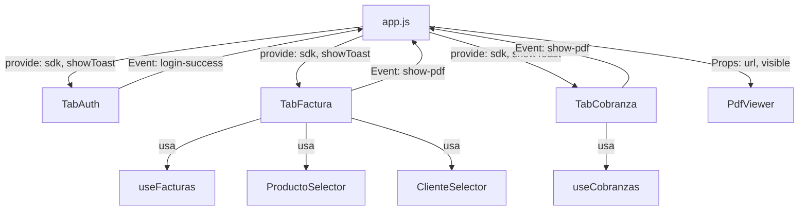

# Plan Divide y Vencerás: Refactorización a Componentes (Pestañas)

**Fecha**: 2025-12-31 (Actualizado)
**Objetivo**: Reducir `app.js` de ~3500 líneas a < 500 líneas mediante la extracción de lógica funcional a componentes Vue.js independientes ("Pestañas").
**Estrategia**: Thin Slicing (Un componente a la vez, manteniendo la app funcional en cada paso).

---

## 🎯 Contexto Técnico

**Template Principal**: `index.html` (Vue 3 standalone desde CDN)
**Componentes**: Archivos `.vue` compilados con Vite (ProductoSelector, ClienteSelector, PuntoVentaSelector ya existen)
**Composables existentes**: `useFacturas`, `useCobranzas`, `usePuntosDeVenta`, `useDiagnostico` (deben ser reutilizados, NO reimplementados)
**SDK**: `XubioClient`, `FacturaService`, `CobranzaService` en `/sdk` (prerequisito para Fase 3+)

---

## 🔄 Estrategia de Commits y Rollback

**Branch**: `refactor/tabs-divide-venceras`
**Commits**: Un commit por fase completada con validación thin slice exitosa
**Rollback**: Si la validación falla → `git reset --hard HEAD~1` y revisar

```bash
# Iniciar refactor
git checkout -b refactor/tabs-divide-venceras

# Después de cada fase
git add .
git commit -m "feat: [Fase X] Descripción"

# Si algo falla
git reset --hard HEAD~1  # Volver al commit anterior
```

---

## 🏗️ Arquitectura Objetivo

El archivo `app.js` dejará de ser un "God Object" para convertirse en un orquestador ligero.



### Roles Definitivos

1.  **`app.js`** (~400-500 líneas):
    *   Mantiene estado global mínimo (`accessToken`, `xubioSdk`, `currentTab`)
    *   Provee `sdk` y `showToast()` vía `provide()`
    *   Controla navegación entre pestañas
    *   Maneja PdfViewer global

2.  **`components/Tab*.vue`**:
    *   Template propio (migrado desde `index.html`)
    *   Estado local de formularios
    *   **CRÍTICO**: Usan `inject('sdk')` y composables existentes (`useFacturas`, etc.)
    *   Emiten eventos para PDFs y notificaciones

3.  **`composables/use*.js`** (YA EXISTEN - NO DUPLICAR):
    *   Lógica de negocio reutilizable
    *   Estado compartido (Singleton pattern)
    *   Validaciones y transformaciones

---

## 📋 Plan de Ejecución

### Fase 0: Prerequisitos y Setup 🔍
**Objetivo**: Validar que todo está listo antes de empezar a mover código.

- [ ] **0.1. Verificar Composables**
    - [ ] Ejecutar `npm run dev` → App carga sin errores
    - [ ] Verificar que `useFacturas.js`, `useCobranzas.js`, `usePuntosDeVenta.js` existen
    - [ ] Verificar que `ProductoSelector.vue`, `ClienteSelector.vue`, `PuntoVentaSelector.vue` existen

- [ ] **0.2. Verificar SDK**
    - [ ] Confirmar que `/sdk/xubioClient.js` existe
    - [ ] Confirmar que `/sdk/facturaService.js` existe
    - [ ] Confirmar que `/sdk/cobranzaService.js` existe
    - [ ] **Plan B**: Si SDK no está completo, usar `composables/useFacturas.js` como fallback temporal

- [ ] **0.3. Crear Branch**
    - [ ] `git checkout -b refactor/tabs-divide-venceras`
    - [ ] `git push -u origin refactor/tabs-divide-venceras`

**Validación Fase 0**:
- [ ] App carga sin errores de consola
- [ ] Todos los archivos prerequisito existen
- [ ] Branch creado correctamente

---

### Fase 1: Infraestructura de Comunicación 🏗️
**Objetivo**: Preparar sistema de provide/inject y estructura de componentes.

- [ ] **1.1. Sistema de Eventos Global**
    - [ ] En `app.js`, agregar al método `setup()` o `created()`:
        ```javascript
        provide('showToast', this.showToast);
        provide('sdk', computed(() => this.xubioSdk));
        ```
    - [ ] Implementar método `showToast(message, type)` en `app.js` si no existe

- [ ] **1.2. Crear Scaffolds de Componentes**
    - [ ] Crear `components/TabAuth.vue` (solo template básico)
    - [ ] Crear `components/TabFactura.vue` (solo template básico)
    - [ ] Crear `components/TabCobranza.vue` (solo template básico)
    - [ ] Crear `components/PdfViewer.vue` (solo template básico)

- [ ] **1.3. Registrar Componentes en app.js**
    - [ ] Importar los 4 componentes nuevos
    - [ ] Registrar en la instancia Vue
    - [ ] Agregar `currentTab: 'auth'` al `data()`

- [ ] **1.4. Agregar Navegación por Pestañas en index.html**
    - [ ] Crear botones/tabs para cambiar `currentTab`
    - [ ] Usar `v-if` o `v-show` para mostrar componente activo

**Validación Fase 1**:
- [ ] App compila sin errores
- [ ] Se puede navegar entre pestañas vacías
- [ ] No hay warnings en consola
- [ ] `provide/inject` funciona (probar con console.log en TabAuth)

**Commit**: `git commit -m "feat: [Fase 1] Infraestructura provide/inject + scaffolds"`

---

### Fase 2: Extracción de Autenticación (TabAuth) 🔐
**Objetivo**: Migrar formulario de login y lógica de token.

- [ ] **2.1. Migración de Template**
    - [ ] Cortar HTML del formulario de credenciales de `index.html` (sección con `clientId`, `secretId`, botón "Obtener Token")
    - [ ] Pegar en `<template>` de `TabAuth.vue`

- [ ] **2.2. Migración de Estado Local**
    - [ ] Mover `clientId`, `secretId`, `guardarCredenciales` al `data()` de `TabAuth`
    - [ ] Mover `tokenResult` (mensajes de éxito/error)

- [ ] **2.3. Migración de Lógica**
    - [ ] Mover método `obtenerToken()` a `TabAuth.vue`
    - [ ] Mover método `limpiarCredenciales()` a `TabAuth.vue`
    - [ ] **Refactor**: En lugar de asignar `this.accessToken`, emitir evento:
        ```javascript
        this.$emit('login-success', { token, expiration });
        ```

- [ ] **2.4. Integración en app.js**
    - [ ] Usar `<tab-auth @login-success="handleLogin" />` en index.html
    - [ ] Implementar `handleLogin(data)` en `app.js`:
        ```javascript
        handleLogin({ token, expiration }) {
          this.accessToken = token;
          this.tokenExpiration = expiration;
          this.xubioSdk = new XubioClient(token);
          this.currentTab = 'factura'; // Cambiar a siguiente pestaña
        }
        ```

- [ ] **2.5. Inyectar showToast en TabAuth**
    - [ ] Usar `inject('showToast')` para notificaciones
    - [ ] Reemplazar `this.tokenResult` por `showToast(mensaje, tipo)`

**Validación Fase 2**:
- [ ] App compila sin errores
- [ ] Login funciona igual que antes
- [ ] Token se guarda correctamente en `app.js`
- [ ] Notificaciones (toast) funcionan
- [ ] Al hacer login exitoso, cambia automáticamente a pestaña Factura

**Commit**: `git commit -m "feat: [Fase 2] TabAuth completo con login funcional"`

---

### Fase 3: El Gran Bloque - Facturación (TabFactura) 🧾
**Objetivo**: Aislar la lógica más pesada usando composables y selectores existentes.

**Prerequisito**: SDK (`XubioClient`, `FacturaService`) debe estar funcional
**Plan B**: Si SDK no está listo, usar `useFacturas.js` directamente

#### 3.1. Definición de Interface y Setup

- [ ] **3.1.1. Definir Props e Inyecciones**
    - [ ] En `TabFactura.vue`, agregar:
        ```javascript
        inject: ['sdk', 'showToast']
        ```
    - [ ] Importar composables:
        ```javascript
        import { useFacturas } from '../composables/useFacturas.js';
        import { usePuntosDeVenta } from '../composables/usePuntosDeVenta.js';
        ```
    - [ ] Importar selectores existentes:
        ```javascript
        import ProductoSelector from './ProductoSelector.vue';
        import ClienteSelector from './ClienteSelector.vue';
        import PuntoVentaSelector from './PuntoVentaSelector.vue';
        ```

- [ ] **3.1.2. Inicializar Composables en setup()**
    - [ ] Llamar a `const facturas = useFacturas();`
    - [ ] Llamar a `const puntosVenta = usePuntosDeVenta();`

**Validación 3.1**:
- [ ] TabFactura compila sin errores
- [ ] `inject` funciona (verificar con console.log)

#### 3.2. Migración de Template

- [ ] **3.2.1. Mover Sección HTML**
    - [ ] Cortar toda la sección `<!-- SECCION 2: FACTURAS -->` de `index.html`
    - [ ] Pegar en `<template>` de `TabFactura.vue`

- [ ] **3.2.2. Reemplazar Selectores Inline por Componentes**
    - [ ] Reemplazar `<select>` de clientes por `<cliente-selector>`
    - [ ] Reemplazar `<select>` de productos por `<producto-selector>`
    - [ ] Reemplazar `<select>` de puntos de venta por `<punto-venta-selector>`
    - [ ] Conectar eventos `@change` de selectores a métodos locales

**Validación 3.2**:
- [ ] Template compila sin errores
- [ ] Selectores se renderizan vacíos (esperado, aún falta lógica)

#### 3.3. Migración de Estado Local

- [ ] **3.3.1. Mover Data de Formularios**
    - [ ] Mover `facturaClienteId`, `productosSeleccionados`, `facturaMoneda`, `facturaCotizacion` al `data()` de TabFactura
    - [ ] Mover `facturaCondicionPago`, `facturaFechaVto`, `facturaDescripcion`
    - [ ] Mover `facturaJson`, `modoAvanzado`
    - [ ] Mover flags UI: `facturaPdfViewerVisible`, `facturaPdfViewerHtml`

- [ ] **3.3.2. Mover Listas**
    - [ ] Mover `monedasList`, `clientesList`, `productosList`, `puntosDeVenta`
    - [ ] **IMPORTANTE**: Estas listas deben cargarse usando composables, no duplicar lógica

**Validación 3.3**:
- [ ] Data definido sin errores
- [ ] Formularios se renderizan con valores por defecto

#### 3.4. Migración de Métodos de Negocio

- [ ] **3.4.1. Métodos de Carga de Datos**
    - [ ] Mover `listarClientes()` → usar `apiClient.get('/clientes')` o composable
    - [ ] Mover `listarProductos()` → usar `apiClient.get('/productos')` o composable
    - [ ] Mover `obtenerPuntosDeVenta()` → **USAR `usePuntosDeVenta().cargar()`**
    - [ ] Mover `obtenerMonedas()` → usar apiClient

- [ ] **3.4.2. Métodos de Validación**
    - [ ] Mover `puedeCrearFactura()` computed → **USAR `useFacturas().puedeCrear()`**
    - [ ] Mover `puntoVentaValido()` computed → delegar a composable

- [ ] **3.4.3. Métodos de Creación**
    - [ ] Mover `flujoCompletoFactura()` → **REFACTOR**:
        ```javascript
        async flujoCompletoFactura() {
          const sdk = inject('sdk');
          const showToast = inject('showToast');
          const { crearFactura } = useFacturas();

          try {
            const payload = this.construirPayload();
            const result = await crearFactura(sdk, payload);
            this.$emit('show-pdf', result.pdfUrl);
            showToast('Factura creada', 'success');
          } catch (error) {
            showToast(error.message, 'error');
          }
        }
        ```
    - [ ] Mover `soloCrearFactura()` → similar a anterior

- [ ] **3.4.4. Métodos Auxiliares**
    - [ ] Mover `construirPayload()` → puede usar `FacturaService` del SDK
    - [ ] Mover `agregarProducto()`, `quitarProducto()`
    - [ ] Mover `calcularTotal()` computed

**Validación 3.4**:
- [ ] Todos los métodos migrados compilan
- [ ] No hay referencias a `this.accessToken` (debe usar `inject('sdk')`)
- [ ] No hay duplicación de lógica de composables

#### 3.5. Integración Final

- [ ] **3.5.1. Conectar en index.html**
    - [ ] Usar `<tab-factura @show-pdf="handleShowPdf" />` en el switch de pestañas
    - [ ] Asegurar que `v-if="currentTab === 'factura'"`

- [ ] **3.5.2. Limpiar app.js**
    - [ ] Eliminar métodos movidos a TabFactura (comentarlos primero, no borrar todavía)
    - [ ] Eliminar data movida (comentar primero)

**Validación Fase 3 Completa**:
- [ ] App compila sin errores
- [ ] Crear factura funciona idénticamente a antes
- [ ] Selectores muestran opciones correctamente
- [ ] Validaciones funcionan (botón disabled cuando faltan datos)
- [ ] PDF se genera y muestra correctamente
- [ ] No hay warnings en consola
- [ ] **Reducción**: app.js debería tener ~1000-1500 líneas menos

**Commit**: `git commit -m "feat: [Fase 3] TabFactura completo con composables integrados"`

---

### Fase 4: Cobranzas (TabCobranza) 💰
**Objetivo**: Aislar la lógica de cobranzas (similar a Fase 3 pero más simple).

- [ ] **4.1. Setup Inicial**
    - [ ] Inyectar `sdk` y `showToast`
    - [ ] Importar `useCobranzas()` composable
    - [ ] Importar `ClienteSelector.vue`
    - [ ] Importar `CobranzaService` del SDK (si está listo)

- [ ] **4.2. Migración de Template**
    - [ ] Mover sección `<!-- SECCION 3: COBRANZAS -->` de `index.html`
    - [ ] Reemplazar select de clientes por `<cliente-selector>`
    - [ ] Mantener estructura de formulario

- [ ] **4.3. Migración de Estado**
    - [ ] Mover `cobranzaClienteId`, `cobranzaImporte`, `cobranzaIdComprobante`
    - [ ] Mover `facturasPendientes`, `facturaParaCobrar`
    - [ ] Mover `cobranzaFormaPago`, `cobranzaCuentaId`, `cuentasDisponibles`
    - [ ] Mover `cobranzaJson`, `modoAvanzado`

- [ ] **4.4. Migración de Métodos**
    - [ ] Mover `listarFacturasPendientes()` → usar composable o apiClient
    - [ ] Mover `flujoCompletoCobranza()` → **REFACTOR**:
        ```javascript
        async flujoCompletoCobranza() {
          const { crearCobranza } = useCobranzas();
          const payload = this.construirPayloadCobranza();
          const result = await crearCobranza(inject('sdk'), payload);
          this.$emit('show-pdf', result.pdfUrl);
        }
        ```
    - [ ] Mover `soloCrearCobranza()`
    - [ ] Mover `obtenerCuentas()`

- [ ] **4.5. Integración**
    - [ ] Conectar en index.html con `v-if="currentTab === 'cobranza'"`
    - [ ] Comentar código movido en app.js

**Validación Fase 4**:
- [ ] App compila sin errores
- [ ] Crear cobranza funciona igual que antes
- [ ] Facturas pendientes se listan correctamente
- [ ] PDF de cobranza se genera
- [ ] **Reducción**: ~500-700 líneas menos en app.js

**Commit**: `git commit -m "feat: [Fase 4] TabCobranza completo"`

---

### Fase 5: Visualizador PDF Reutilizable 📄
**Objetivo**: Centralizar lógica de visualización de PDFs.

- [ ] **5.1. Componente PdfViewer.vue**
    - [ ] Props: `url: String`, `visible: Boolean`
    - [ ] Template: `<iframe>` con controles de cerrar
    - [ ] Event: `@close` para cerrar viewer

- [ ] **5.2. Estado Global en app.js**
    - [ ] Agregar `pdfUrl: null`, `pdfVisible: false` al data()
    - [ ] Método `handleShowPdf(url)`:
        ```javascript
        handleShowPdf(url) {
          this.pdfUrl = url;
          this.pdfVisible = true;
        }
        ```
    - [ ] Método `closePdf()` para cerrar

- [ ] **5.3. Integración Global**
    - [ ] Colocar `<pdf-viewer :url="pdfUrl" :visible="pdfVisible" @close="closePdf" />` en index.html (fuera del switch de pestañas)
    - [ ] Conectar evento `@show-pdf` de todos los Tab* a `handleShowPdf`

- [ ] **5.4. Limpieza**
    - [ ] Eliminar `facturaPdfViewerHtml`, `cobranzaPdfViewerHtml` de TabFactura y TabCobranza
    - [ ] Eliminar iframes individuales de cada pestaña

**Validación Fase 5**:
- [ ] App compila sin errores
- [ ] PDFs de facturas se muestran correctamente
- [ ] PDFs de cobranzas se muestran correctamente
- [ ] Cerrar PDF funciona
- [ ] Un solo PdfViewer se usa para todo

**Commit**: `git commit -m "feat: [Fase 5] PdfViewer centralizado"`

---

### Fase 6: Limpieza Final (Poda) 🧹
**Objetivo**: Eliminar código muerto y validar objetivo de < 500 líneas.

- [ ] **6.1. Eliminar Data Muerta en app.js**
    - [ ] Borrar todas las variables `factura*` movidas a TabFactura
    - [ ] Borrar todas las variables `cobranza*` movidas a TabCobranza
    - [ ] Borrar `tokenResult` movido a TabAuth
    - [ ] Mantener SOLO: `accessToken`, `tokenExpiration`, `xubioSdk`, `currentTab`, `pdfUrl`, `pdfVisible`

- [ ] **6.2. Eliminar Métodos Muertos**
    - [ ] Buscar métodos comentados en fases anteriores
    - [ ] Verificar que NO se usan en ningún lado (grep en codebase)
    - [ ] Borrar definitivamente

- [ ] **6.3. Limpiar Imports**
    - [ ] Eliminar imports de `FacturaService`, `CobranzaService` (ahora están en Tab*)
    - [ ] Eliminar imports de selectores (ahora están en Tab*)
    - [ ] Mantener SOLO: `XubioClient`, componentes Tab*, PdfViewer

- [ ] **6.4. Verificar Tamaño**
    - [ ] Ejecutar: `wc -l app.js`
    - [ ] **Objetivo**: < 500 líneas
    - [ ] Si excede: identificar qué más se puede extraer

- [ ] **6.5. Code Review Manual**
    - [ ] Leer app.js línea por línea
    - [ ] Verificar que solo contiene:
        - Inicialización de Vue
        - Estado global mínimo
        - Métodos `handleLogin`, `handleShowPdf`, `closePdf`
        - Registro de componentes
        - `provide()` para sdk y showToast
    - [ ] Todo lo demás debe estar en componentes o composables

**Validación Fase 6**:
- [ ] App compila sin errores
- [ ] Todas las funcionalidades siguen funcionando
- [ ] **app.js tiene < 500 líneas** ✅
- [ ] No hay código comentado
- [ ] No hay imports no usados

**Commit**: `git commit -m "feat: [Fase 6] Limpieza final - app.js < 500 líneas"`

---

## ✅ Checklist de Éxito (Definition of Done)

### Funcionalidad
- [ ] **Login**: TabAuth permite autenticarse y obtener token
- [ ] **Facturación**: TabFactura crea facturas idénticamente a versión anterior
- [ ] **Cobranzas**: TabCobranza crea cobranzas idénticamente a versión anterior
- [ ] **PDFs**: Se generan y visualizan correctamente desde cualquier pestaña
- [ ] **Validaciones**: Todas las validaciones de formularios funcionan
- [ ] **Selectores**: ProductoSelector, ClienteSelector, PuntoVentaSelector funcionan correctamente

### Arquitectura
- [ ] **app.js < 500 líneas** (actualmente ~3500)
- [ ] Componentes Tab* usan composables existentes (NO duplican lógica)
- [ ] Componentes Tab* usan selectores existentes (reutilización)
- [ ] PdfViewer centralizado (un solo componente para todos los PDFs)
- [ ] Sistema provide/inject funciona correctamente
- [ ] Sin warnings ni errores en consola

### Código Limpio
- [ ] Sin código comentado en app.js
- [ ] Sin imports no usados
- [ ] Sin duplicación de lógica entre Tab* y composables
- [ ] JSDoc actualizado en archivos modificados

### Testing Manual
- [ ] Flujo completo Login → Factura → PDF funciona
- [ ] Flujo completo Login → Cobranza → PDF funciona
- [ ] Navegación entre pestañas sin pérdida de estado (si es necesario mantenerlo)
- [ ] Manejo de errores muestra notificaciones correctamente

---

## 🎯 Resultado Final Esperado

### Antes
- **app.js**: ~3500 líneas
- **Responsabilidades**: TODO mezclado (UI + lógica + API + validaciones)
- **Duplicación**: Alta (lógica repetida)
- **Mantenibilidad**: Baja (IA no puede leer el archivo completo)

### Después
- **app.js**: ~400-500 líneas (solo orquestación)
- **TabAuth.vue**: ~150-200 líneas (login + credenciales)
- **TabFactura.vue**: ~400-500 líneas (formulario + integración con composables)
- **TabCobranza.vue**: ~250-300 líneas (formulario + integración)
- **PdfViewer.vue**: ~50-100 líneas (visualizador reutilizable)
- **Composables**: Reutilizados desde `/composables` (sin duplicación)
- **SDK**: Usado desde `/sdk` (lógica de negocio pura)
- **Mantenibilidad**: Alta (IA puede trabajar con cada archivo independientemente)

---

## ⚠️ Riesgos y Mitigaciones

### Riesgos Identificados

1. **Romper funcionalidad existente al mover código**
   - **Mitigación**: Validación thin slice obligatoria después de cada fase
   - **Rollback**: `git reset --hard HEAD~1` si validación falla

2. **Duplicar lógica entre Tab* y composables**
   - **Mitigación**: Revisión explícita en Fase 3.4 - USAR composables, no reimplementar
   - **Señal de alerta**: Si ves código copy-paste de app.js a Tab*, STOP y usar composable

3. **SDK no está listo para usar en Fase 3**
   - **Mitigación Plan B**: Usar `useFacturas.js` temporalmente hasta que SDK esté listo
   - **Criterio**: Si SDK no tiene tests o está incompleto, usar composable

4. **Estado desincronizado entre componentes**
   - **Mitigación**: Usar provide/inject para datos globales (sdk, token)
   - **Patrón**: Estado local en Tab*, estado global en app.js

5. **Pérdida de funcionalidad de diagnóstico/debug**
   - **Mitigación**: `useDiagnostico()` debe ser inyectado en Tab* si es necesario
   - **Validación**: Verificar que logs y diagnósticos siguen funcionando

### Señales de Alerta Durante Refactor

🚨 **DETENER si**:
- [ ] Hay > 3 errores de compilación después de mover código
- [ ] La validación thin slice falla 2 veces seguidas
- [ ] Encuentras código que no entiendes (pedir a IA que explique primero)
- [ ] Detectas duplicación de lógica (usar composable en vez de copiar)

✅ **Continuar si**:
- [ ] Validación thin slice pasa
- [ ] Commits son incrementales y reversibles
- [ ] IA puede leer archivos completos sin límite de tokens

---

## 📊 Métricas de Éxito

### Antes del Refactor
```bash
wc -l app.js
# ~3500 líneas
```

### Después del Refactor (Objetivo)
```bash
wc -l app.js TabAuth.vue TabFactura.vue TabCobranza.vue PdfViewer.vue
# app.js: 400-500 líneas
# TabAuth.vue: 150-200 líneas
# TabFactura.vue: 400-500 líneas
# TabCobranza.vue: 250-300 líneas
# PdfViewer.vue: 50-100 líneas
# TOTAL: ~1250-1600 líneas (distribuidas en 5 archivos manejables)
```

### Ganancia para Vibecoding con IA
- ✅ **Antes**: app.js con 43,606 tokens → IA NO puede leer completo (límite 25k)
- ✅ **Después**: Archivos individuales < 10k tokens → IA puede leer CUALQUIER archivo completo
- ✅ **Resultado**: Flujo de trabajo fluido sin limitaciones de contexto

---

**Última actualización**: 2025-12-31
**Estado**: 📋 Plan Mejorado - Listo para Ejecución
**Estrategia**: Thin Slicing + Validación Continua + Reutilización de Composables
