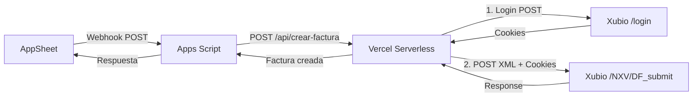

# Plan: Endpoint Serverless Vercel como Intermediario Xubio

**Fecha**: 2025-12-31
**Objetivo**: Crear endpoint serverless en Vercel que permita a Apps Script crear facturas en Xubio usando cookies de sesión
**Estrategia**: Thin Slicing (Login por request → Optimización con cache después)

---

## 🎯 Contexto Técnico

**Problema identificado**:
- OAuth de Xubio NO funciona para crear facturas (5 intentos fallidos documentados)
- Endpoint XML Legacy `/NXV/DF_submit` requiere cookies de sesión del navegador
- Google Apps Script no puede manejar cookies de sesión directamente

**Solución propuesta**:
- Endpoint serverless en Vercel que hace login con usuario/contraseña
- Obtiene cookies de sesión válidas
- Hace POST a Xubio con cookies
- Apps Script → Vercel endpoint → Xubio

**Stack técnico**:
- Vercel Serverless Functions (Node.js)
- Template XML Legacy GOLD (ya validado)
- Apps Script (cliente)

---

## 🏗️ Arquitectura Objetivo



### Componentes

1. **`/api/crear-factura.js`** (Vercel Serverless Function):
   - Recibe: `{ clienteId, clienteNombre, provinciaId, provinciaNombre, localidadId, localidadNombre, cantidad }`
   - Login a Xubio con credenciales
   - Construye XML Legacy GOLD
   - POST a `/NXV/DF_submit` con cookies
   - Retorna: `{ success, transaccionId, numeroDocumento, pdfUrl }`

2. **`XubioFacturacion.js`** (Apps Script - modificado):
   - En lugar de llamar directamente a Xubio
   - Llama a endpoint Vercel
   - Maneja respuesta y retorna a AppSheet

3. **Template GOLD**:
   - Ya existe: `test-imprimir-pdf/docs/TEMPLATE_GOLD_XML_LEGACY.xml`
   - Se reutiliza para construir payload

---

## 📋 Plan de Ejecución

### Fase 0: Setup Inicial 🔍

**Objetivo**: Preparar estructura de proyecto para serverless functions

- [ ] **0.1. Verificar estructura del proyecto**
    - [ ] Confirmar que existe `test-imprimir-pdf/vue-app/` (app actual)
    - [ ] Verificar que está desplegado en Vercel
    - [ ] Obtener URL de producción de Vercel

- [ ] **0.2. Crear carpeta API**
    - [ ] Crear `test-imprimir-pdf/api/` en el root del proyecto
    - [ ] Vercel auto-detecta esta carpeta para serverless functions

- [ ] **0.3. Obtener credenciales Xubio**
    - [ ] Usuario y contraseña para login programático
    - [ ] Confirmar que NO son las credenciales OAuth (son diferentes)
    - [ ] Guardar en variables de entorno de Vercel

**Validación Fase 0**:
- [ ] Carpeta `/api` existe
- [ ] Credenciales disponibles
- [ ] URL de Vercel conocida

---

### Fase 1: Endpoint Básico (Login + Test) 🔐

**Objetivo**: Crear endpoint que solo hace login y retorna cookies

- [ ] **1.1. Crear función serverless básica**
    - [ ] Crear archivo `api/test-login.js`
    - [ ] Estructura básica:
        ```javascript
        export default async function handler(req, res) {
          if (req.method !== 'POST') {
            return res.status(405).json({ error: 'Method not allowed' });
          }

          res.status(200).json({ message: 'Endpoint funcionando' });
        }
        ```

- [ ] **1.2. Configurar variables de entorno en Vercel**
    - [ ] Ir a Vercel Dashboard → Settings → Environment Variables
    - [ ] Agregar `XUBIO_USERNAME` (usuario de Xubio)
    - [ ] Agregar `XUBIO_PASSWORD` (contraseña de Xubio)
    - [ ] Agregar `XUBIO_EMPRESA_ID` (234054)

- [ ] **1.3. Implementar lógica de login**
    - [ ] POST a `https://xubio.com/login` con credentials
    - [ ] Capturar cookies de respuesta (Set-Cookie headers)
    - [ ] Retornar cookies en respuesta de test

- [ ] **1.4. Deploy y test**
    - [ ] Hacer commit y push
    - [ ] Vercel auto-deploys
    - [ ] Probar con Postman: `POST https://tu-app.vercel.app/api/test-login`
    - [ ] Verificar que retorna cookies válidas

**Validación Fase 1**:
- [ ] Endpoint accesible públicamente
- [ ] Login a Xubio funciona
- [ ] Cookies válidas retornadas
- [ ] Response 200 OK

**Commit**: `git commit -m "feat: [Fase 1] Endpoint test-login funcional"`

---

### Fase 2: Construcción de Payload XML 🏗️

**Objetivo**: Crear función que construye XML Legacy GOLD dinámicamente

- [ ] **2.1. Crear utilidad de construcción XML**
    - [ ] Crear archivo `api/utils/buildXMLPayload.js`
    - [ ] Importar template GOLD como referencia
    - [ ] Función que recibe: `{ cliente, cantidad, cotizacion, fechaISO }`
    - [ ] Retorna: String XML completo

- [ ] **2.2. Reutilizar lógica de Apps Script**
    - [ ] Copiar función `construirPayloadXML()` de `XubioFacturacion.js`
    - [ ] Adaptar para Node.js (sin `Utilities.formatDate`)
    - [ ] Usar `new Date().toISOString().split('T')[0]` para fechas

- [ ] **2.3. Validar XML generado**
    - [ ] Crear test unitario simple
    - [ ] Comparar con template GOLD línea por línea
    - [ ] Asegurar que todos los campos requeridos están presentes

**Validación Fase 2**:
- [ ] Función genera XML válido
- [ ] XML tiene TODAS las secciones del template GOLD
- [ ] Valores dinámicos se reemplazan correctamente
- [ ] No hay syntax errors en XML

**Commit**: `git commit -m "feat: [Fase 2] Utilidad buildXMLPayload funcional"`

---

### Fase 3: Endpoint Completo (Login + POST Xubio) 📤

**Objetivo**: Endpoint que hace login, construye XML y crea factura

- [ ] **3.1. Crear endpoint principal**
    - [ ] Crear archivo `api/crear-factura.js`
    - [ ] Importar `buildXMLPayload` de utils

- [ ] **3.2. Implementar flujo completo**
    - [ ] Validar input del request:
        ```javascript
        const { clienteId, clienteNombre, provinciaId, provinciaNombre,
                localidadId, localidadNombre, cantidad } = req.body;
        ```
    - [ ] **Paso 1**: Login a Xubio y obtener cookies
    - [ ] **Paso 2**: Construir XML con `buildXMLPayload()`
    - [ ] **Paso 3**: POST a `/NXV/DF_submit` con:
        - Body: `body=<df>...</df>` (URL encoded)
        - Headers: Cookies de sesión
        - Content-Type: `application/x-www-form-urlencoded`
    - [ ] **Paso 4**: Parsear respuesta de Xubio
    - [ ] **Paso 5**: Retornar resultado

- [ ] **3.3. Manejo de errores**
    - [ ] Try-catch en cada paso
    - [ ] Logs detallados con `console.log()`
    - [ ] Response con error descriptivo si falla

- [ ] **3.4. Deploy y test manual**
    - [ ] Push a Vercel
    - [ ] Probar con Postman:
        ```json
        POST https://tu-app.vercel.app/api/crear-factura
        {
          "clienteId": 8157173,
          "clienteNombre": "2MCAMPO",
          "provinciaId": 1,
          "provinciaNombre": "Buenos Aires",
          "localidadId": 147,
          "localidadNombre": "Saladillo",
          "cantidad": 1
        }
        ```
    - [ ] Verificar que factura se crea en Xubio
    - [ ] Verificar response con transaccionId

**Validación Fase 3**:
- [ ] Endpoint crea factura real en Xubio
- [ ] Response incluye transaccionId válido
- [ ] No hay errores de cookies o sesión
- [ ] Logs en Vercel muestran flujo completo

**Commit**: `git commit -m "feat: [Fase 3] Endpoint crear-factura completo"`

---

### Fase 4: Integración con Apps Script 🔌

**Objetivo**: Modificar Apps Script para usar endpoint Vercel en lugar de OAuth

- [ ] **4.1. Crear nueva función en Apps Script**
    - [ ] Crear `crearFacturaViaVercel()` en `XubioFacturacion.js`
    - [ ] URL del endpoint: `https://tu-app.vercel.app/api/crear-factura`
    - [ ] Headers: `Content-Type: application/json`

- [ ] **4.2. Implementar llamada HTTP**
    - [ ] Usar `UrlFetchApp.fetch()` con método POST
    - [ ] Payload JSON:
        ```javascript
        const payload = {
          clienteId: cliente.id,
          clienteNombre: cliente.nombre,
          provinciaId: cliente.provinciaId,
          provinciaNombre: cliente.provinciaNombre,
          localidadId: cliente.localidadId,
          localidadNombre: cliente.localidadNombre,
          cantidad: cantidad
        };
        ```
    - [ ] Parsear respuesta JSON
    - [ ] Manejar errores con retry logic

- [ ] **4.3. Modificar función principal**
    - [ ] Renombrar `crearFacturaAGDP()` actual a `crearFacturaAGDP_OAuth()` (backup)
    - [ ] Crear nueva `crearFacturaAGDP()` que llame a `crearFacturaViaVercel()`
    - [ ] Mantener misma firma de función para compatibilidad con `testCrearFactura()`

- [ ] **4.4. Test end-to-end**
    - [ ] Ejecutar `testCrearFactura()` en Apps Script
    - [ ] Verificar que factura se crea en Xubio
    - [ ] Verificar logs en Apps Script
    - [ ] Verificar logs en Vercel

**Validación Fase 4**:
- [ ] `testCrearFactura()` funciona correctamente
- [ ] Factura se crea en Xubio vía Vercel
- [ ] No errores de autenticación
- [ ] Response incluye todos los datos esperados

**Commit**: `git commit -m "feat: [Fase 4] Apps Script integrado con Vercel endpoint"`

---

### Fase 5: Optimización (Opcional - Cache de Cookies) ⚡

**Objetivo**: Mejorar performance cacheando cookies de sesión

**NOTA**: Solo implementar si Fase 1-4 funcionan y hay problemas de latencia

- [ ] **5.1. Configurar Vercel KV (Redis)**
    - [ ] Activar Vercel KV en dashboard
    - [ ] Instalar `@vercel/kv` en proyecto
    - [ ] Configurar conexión en serverless function

- [ ] **5.2. Implementar cache de cookies**
    - [ ] Clave: `xubio_session_cookies`
    - [ ] TTL: 1 hora (3600 segundos)
    - [ ] Al hacer login exitoso: guardar cookies en KV
    - [ ] Al recibir request: primero intentar con cookies cacheadas
    - [ ] Si 401: invalidar cache, re-login, guardar nuevas cookies

- [ ] **5.3. Métrica de mejora**
    - [ ] Medir latencia antes (sin cache): ~X segundos
    - [ ] Medir latencia después (con cache): ~Y segundos
    - [ ] Objetivo: Reducir 50% del tiempo

**Validación Fase 5**:
- [ ] Cache funciona correctamente
- [ ] Cookies se renuevan automáticamente al expirar
- [ ] Latencia reducida significativamente

**Commit**: `git commit -m "feat: [Fase 5] Cache de cookies con Vercel KV"`

---

## ✅ Checklist de Éxito (Definition of Done)

### Funcionalidad
- [ ] Endpoint Vercel accesible públicamente
- [ ] Login a Xubio funciona con usuario/contraseña
- [ ] Construcción de XML Legacy GOLD dinámica
- [ ] POST a `/NXV/DF_submit` con cookies exitoso
- [ ] Factura se crea en Xubio correctamente
- [ ] Apps Script integrado y funcional
- [ ] `testCrearFactura()` pasa sin errores

### Arquitectura
- [ ] Endpoint serverless en `/api/crear-factura.js`
- [ ] Utilidad reutilizable en `/api/utils/buildXMLPayload.js`
- [ ] Variables de entorno configuradas en Vercel
- [ ] Logs detallados para debugging
- [ ] Manejo de errores robusto

### Seguridad
- [ ] Credenciales en variables de entorno (NO hardcoded)
- [ ] Endpoint valida input antes de procesar
- [ ] No expone información sensible en logs públicos
- [ ] CORS configurado correctamente

### Documentación
- [ ] README actualizado con instrucciones de setup
- [ ] Variables de entorno documentadas
- [ ] Ejemplos de request/response
- [ ] Troubleshooting common issues

---

## 🎯 Resultado Final Esperado

### Antes (OAuth fallido)
- ❌ Apps Script → OAuth → Xubio REST API (no funciona)
- ❌ Apps Script → OAuth → Xubio XML Legacy (NullPointerException)
- ❌ 5 intentos fallidos documentados

### Después (Vercel intermediario)
- ✅ Apps Script → Vercel endpoint → Xubio con cookies (funciona)
- ✅ Latencia aceptable (~2-3 segundos sin cache, ~1 segundo con cache)
- ✅ Confiable y escalable
- ✅ Listo para integración con AppSheet

---

## ⚠️ Riesgos y Mitigaciones

### Riesgos Identificados

1. **Credenciales de Xubio inválidas**
   - **Mitigación**: Validar credentials con login manual antes de implementar
   - **Test**: Hacer login manual en navegador con mismas credentials

2. **Cookies expiran muy rápido**
   - **Mitigación**: Implementar auto-renovación con retry logic
   - **Monitoreo**: Logs de expiración de cookies

3. **Xubio bloquea IPs de Vercel**
   - **Mitigación**: Rotar entre múltiples regiones de Vercel
   - **Plan B**: Usar proxy o VPN si es necesario

4. **Rate limiting de Xubio**
   - **Mitigación**: Implementar rate limiting en endpoint Vercel
   - **Caché**: Reducir requests con cookies cacheadas

5. **Endpoint público expuesto**
   - **Mitigación**: Agregar API Key validation
   - **Seguridad**: Solo Apps Script conoce la API Key

### Señales de Alerta Durante Implementación

🚨 **DETENER si**:
- [ ] Login a Xubio falla 3 veces seguidas
- [ ] Cookies siempre expiran inmediatamente (< 1 minuto)
- [ ] Xubio bloquea IPs de Vercel permanentemente
- [ ] XML generado causa errores de parsing en Xubio

✅ **Continuar si**:
- [ ] Login funciona consistentemente
- [ ] Cookies duran al menos 15 minutos
- [ ] POST a `/NXV/DF_submit` retorna 200 OK
- [ ] Factura se crea correctamente en Xubio

---

## 📊 Archivos Involucrados

### Nuevos archivos
- `api/crear-factura.js` (endpoint principal)
- `api/test-login.js` (endpoint de prueba)
- `api/utils/buildXMLPayload.js` (construcción de XML)

### Archivos modificados
- `apps-script/XubioFacturacion.js` (integración con Vercel)
- `apps-script/README.md` (instrucciones actualizadas)

### Archivos de referencia
- `docs/TEMPLATE_GOLD_XML_LEGACY.xml` (template)
- `docs/planes/plan-endpoint-vercel-xubio.md` (este plan)

---

## 📝 Próximos Pasos Después del Éxito

1. **Integración con AppSheet**:
   - Configurar webhook en AppSheet
   - Apuntar a Apps Script (que ahora usa Vercel)
   - Probar flujo completo: AppSheet → Apps Script → Vercel → Xubio

2. **Monitoreo**:
   - Configurar alertas en Vercel para errores
   - Dashboard de métricas (latencia, éxito/fallo)
   - Logs centralizados

3. **Optimización**:
   - Implementar cache de cookies (Fase 5)
   - Reducir latencia
   - Optimizar payload XML (eliminar campos innecesarios)

4. **Documentación para usuario**:
   - Video tutorial de configuración
   - FAQ común
   - Guía de troubleshooting

---

**Última actualización**: 2025-12-31
**Estado**: 📋 Plan Listo para Ejecución
**Estrategia**: Login por request (simple) → Cache opcional (optimización)
**Tiempo estimado**: 2-3 horas para Fases 0-4
